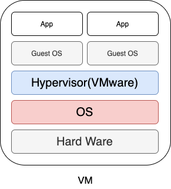
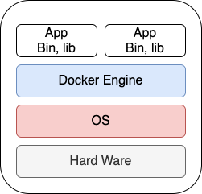

# Docker

Solomon Hykes가 발표한 경이로운 기술.  
먼저 도커를 한 마디로 정의하자면 `컨테이너 기반의 오픈소스 가상화 플랫폼`이다.
컨테이너, 가상화... 말이 참 어렵다.  

**컨테이너**라 함은 많은 물건들을 담아 놓는 하나의 박스이다.  
도커에서의 컨테이너도 비슷한 의미인데 여기서 물건은 *실행환경에 필요한 것들 ex) 서버, 환경변수 등...* 이다. 이런 컨테이너를 가상화(논리적으로 만들어 놓음) 시켜 동작을 하는 것이다. 그렇다면 이러한 `컨테이너 가상화 기술`은 왜 등장하게 되었을까?  

들어가기에 앞서 `가상화(Virtualization)`와 `추상화(abstraction)`에 대해서 짚고 넘어가자.  
**가상화**란 실제로 존재하는 하나를 논리적으로 여러개로 나누는것이다.  
예를 들어, 길이 9인 하나의 배열을 0~2, 3~5, 5~8의 인덱스를 각각 다른 용도로 사용하겠다고 정의내린 것이라고 볼 수 있겠다.  
**추상화**란 논리적으로 나눠진 것 중 하나의 조각이라고 볼 수 있겠다. 위의 예시에서 0~2를 3의 나머지를 저장하는 공간으로 사용하겠다!라고 정의 내린것이 추상화. 실제로 하나인 것 중 어떠한 용도로 사용하겠다고 `정의`내린 것이다.

 

## 가상화 기술
먼저 가상화가 등장하고 쓰이게 된 이유부터 말하자면, 하드웨어의 비약적인 발전으로 인해서 하나의 하드웨어에서 서버가 사용하는 자원은 10~15% 밖에 되지 않는다고 한다. 남는 공간을 효율적으로 생성하고자 하드웨어를 가상화시키는 프로그램을 사용하였다. 바로 `하이퍼 바이저(단일 하드웨어에서 여러 가상 머신(하드웨를 가상화시킴)을 호스팅할 수 있는 논리적 플랫폼 ex) VMware, Virtual Box)`. 하이퍼 바이저 위에서 가상 머신(가상 하드웨어)을 만들어 낼 수 있다. 이 가상 머신은 각각의 OS를 가지고 그 위에서 별개의 서버를 돌릴 수 있게 된다. **하나의 물리적 머신 위에서 다수 개의 가상 하드웨어**를 사용할 수 있게 된것. 이렇게 함으로써 물리적 머신(하나의 하드웨어)을 늘리지 않고 하나의 물리적 머신의 공간을 나누어 비용 및 공간의 사용이 용이해졌다.  

 

이러한 `하드웨어 가상화`는 전가상화 와 반가상화 두 종류로 나눠 볼 수 있다.  
**전가상화**는 하드웨어를 완전히 가상화 시키는 방법이다. 이렇게 나눠진 각 가상 머신의 Guest OS들은 장치 제어를 위해 CPU를 이용해야하는데 전가상화는 CPU도 가상화 기능을 사용해 나누기 때문에 성능저하가 일어난다.  
**반가상화**는 하드웨워를 전부 가상화 시키지 않는다. 하이퍼 바이저가 중간에서 Guest OS의 CPU 이용을 제어하는데 이럴경우 직접 CPU를 사용하는 것이 아니기 때문에 Guest OS의 종류에 따라 명령어가 달라지므로 CPU가 알아들을 수 있게 전환해야한다. 대부분의 클라우드 서비스(AWS 등)에서 이 반가상화 기술을 사용한다  
즉, `하드웨어를 가상화 시키고, OS Layer를 추상화시켜 사용했다고 할 수 있다.`

이런 놀라운 기술 속에서도 성능의 문제는 있기 마련이다. 하나의 가상머신에 하나의 OS를 가지므로 설치 시간 및 공간또한 낭비되는 것이다. 이러한 단점을 개선하기 위해 `OS 가상화 방식`이 등장한다! 하나의 Host OS가 관리하여 사용하고 하나의  서버를 하나의 컨테이너로 만든다. 이 컨테이너 하나를 프로세스로서 취급하는 것이다. `도커는 OS를 가상화시키고, App Layer를 추상화 시킨 것이다.`  

CPU, 메모리는 프로세스가 필요한 만큼만 추가로 사용하고 새로운 OS를 따로 설치할 필요가 없어지니 메모리 낭비를 더 줄이고 Guest OS의 존재가 사라져 CPU로의 요청 등의 시간적 손실이 없어지니 성능적으로 손실이 거의 없게 된다.

 

## 도커의 특징
### Image
`Image`, 컨테이너 실행에 필요한 파일, 설정값을 포함하고 있다. 동적으로 변하지 않는다는 특징을 가지고 있고, 컨테이너는 이 Image를 실행한 상태라고 할 수 있다. 말 그대로 실행 파일이다. 컨테이너를 종료하던 삭제하던 이 Image는 남아 있고 이 이미지로 언제든 컨테이너를 생성시킬 수 있다. 이미지를 만들기 위해서 `Dockerfile`이라는 파일에 *DSL 언어*를 이용해 이미지의 생성과정을 적는다. 이런 도커 이미지는 Docker hub에 올려 관리할 수 있다. 

 

### 유니온 파일 시스템
먼저, `유니온 파일 시스템`을 설명해보자면, 복수의 파일시스템을 하나로 마운트하는 기능이다. 도커는 레이어라는 개념을 사용해 유니온 파일 시스템을 이용한다. => `AUFS(advanced multi-layered unification filesystem)`  
`Image`는 여러개의 R/O(읽기 전용) 레이어로 구성되고, 이 레이어들(즉, 여러 파일들)이 추가되거나 수정되면 새로운 레이어가 쌓인다. 여기서 수정된 레이어는 나중에 올라온 레이어로 덮어씌어져서 아주 용이하다!

 

### 컨테이너
`Image`를 실행 시킨 것. 이미지의 인스턴스라고 할 수 있다.  
위의 유니온 파일 시스템에서 가장 상위인 컨테이너 레이어로써 쓰기가 가능한 레이어다.
컨테이너 생성되 후 모든 변경작업은 이 레이어에서 이루어진다. 쓰기 작업은 이미지 레이어의 파일을 복사해서 이루어지기 때문에 이미지 레이어의 파일들의 원본이 직접 수정되는 일은 없다.

 

[참고 url - https://subicura.com/2017/01/19/docker-guide-for-beginners-1.html](https://subicura.com/2017/01/19/docker-guide-for-beginners-1.html)

 

### 추가
- 네트워크 모드는 Bridge모드로 조금의 성능 손실이 있음.
네트워크 성능이 중요한 경우 --net=host 옵션을 사용!
