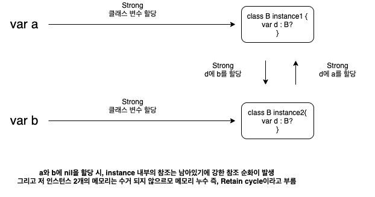

# 스위프트의 메모리 관리, Retain cycle

## 스위프트의 메모리 관리(Memory Management)
스위프트는 앱의 메모리 사용을 추적하고 관리하는 `ARC(Automatic Reference Counting - 자동참조계수)`를 사용한다.  
인스턴스가 더이상 필요없을때 클래스 인스턴스에 사용된 메모리를 자동적으로 해제하고,  
인스턴스가 필요한 동안에는 사라지지 않게 하기 위해, ARC는 클래스 인스턴스를 참조하는 [속성,상수,변수]의 수를 추적, 관리한다.  

ARC는 적어도 하나의 활성화 참조(reference counting > 0)가 있다면 할당해제를 하지 않는다.  
reference counting은 오직 참조타입에만 해당된다. 즉, struct, enum은 값 타입이므로, 해당되지 않는다.  
위와 같이 ARC가 스스로 메모리 관리를 해주므로 거의 신경을 쓰지 않아도 된다.(몇 가지는 신경 써줘야함.)

<br>

### **strong reference**
객체에대한 레퍼런스를 정의시 strong, weak, unowned 이 3가지 방법이 있다. 그중 strong에 대해서 알아보자.  
[속성,상수,변수]에 클래스 인스턴스를 할당할때, [속성,상수,변수]는 인스턴스에 강한 참조를 만든다.  
`강한 참조`란 인스턴스를 강하게 유지한다는 뜻으로 강한참조가 생성 시 reference counting이 1 증가한다.  
이 강한 참조가 남아있다면 해당 인스턴스를 할당 해제하지 못한다. 
ARC가 메모리 해제를 해주는 것은 reference counting이 0개인 인스턴스에 해당하기 때문이다.(즉, 절대 해제하지 말아야할때 강한 참조를 한다???)  
이렇게 메모리를 해재하지 못하고 메모리가 남아있는 메모리 누수현상을 보고 `Retain Cycle`이라고 한다. 




클래스 인스턴스가 강력참조를 가지지 못하게 해야한다.  
만약 클래스 인스턴스가 강력참조를 가지게 된다면 강력 참조 순환이 일어난다.  
이를 약한 참조(weak reference), 미소유 참조(unowned reference)로 클래스 간의 관계를 정의하여 해결할 수 있다.  

<br>

또다른 예시를 보자면,  
클로져가 바깥의 값을 사용할 때는 값을 복사하여 사용x  
해당 값을 참조하여 사용한다! 
클로져 내에서 self를 사용하면 그 클로져 블록 밖의 객체를 강한 참조하므로 그 객체의 인스턴스를 할당 받은 변수에 nil을 넣어도 메모리해제가 이루어지지 않는다.  
이에 클로져 블록 내에 self를 weak나 unowned으로 참조한다.  
위를 쓰지 않으면 자동으로 default 즉, strong으로 할당된다.  
```swift
var info : () -> Void = { [weak self] in
    // weak는 옵셔널 이므로 self에 ?붙여준다. 
    print(self?.name)
}
```
클로져를 지역적으로 사용(변수에 저장 등이 아닌 바로 사용하는 용도)시, 강한참조를 하는 것이 아니므로, 레퍼런스타입을 사용하지 않아도 됨.


### **weak reference**
약한참조는 객체의 reference couting을 변화시키지 않는다.  
즉, 약한참조만이 남아있다면 그 객체의 메모리를 해제하고 약한 참조를 가지고 있는 변수는 자동으로 nil이 된다. 그러므로, weak 변수는 반드시 optional타입이어야 한다!  

### **unowned reference**
미소유참조는 약한참조와 마찬가지로 reference counting을 변화시키지 않는다.  
but, 항상 값이 있음을 가정하기에 옵셔널 타입이다. 만약 인스턴스가 메모리에서 해제되고 나서도 접근을 한다면 runtime exception을 내뿜는다. so, 해당 변수가 기리키는 객체의 메모리가 해제되고도 그 곳을 가리키지 않는다는 확신이 있으면 사용해야한다.  


